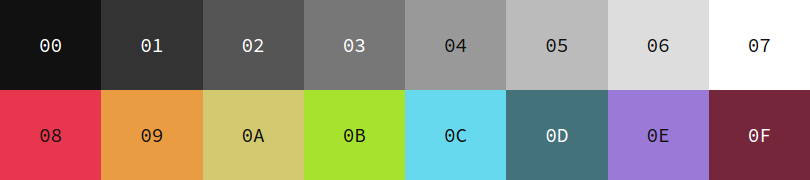

# base16-chromodynamics
Base16 colors based on https://github.com/MagicStack/Chromodynamics

## Preview

## Credits
 - [Briles/Base16Designer](https://github.com/Briles/Base16Designer)
 - [MagicStack/Chromodynamics](https://github.com/MagicStack/Chromodynamics)
